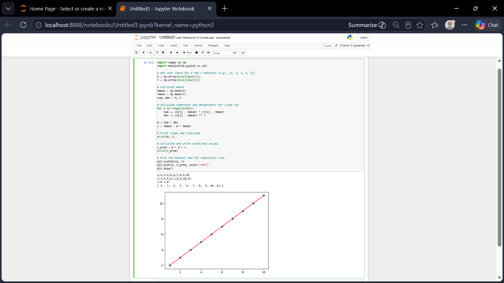

# Implementation of Univariate Linear Regression
## Aim:
To implement univariate Linear Regression to fit a straight line using least squares.
## Equipment’s required:
1.	Hardware – PCs
2.	Anaconda – Python 3.7 Installation / Moodle-Code Runner
## Algorithm:
1.	Get the independent variable X and dependent variable Y.
2.	Calculate the mean of the X -values and the mean of the Y -values.
3.	Find the slope m of the line of best fit using the formula.
 
4.	Compute the y -intercept of the line by using the formula:
  
5.	Use the slope m and the y -intercept to form the equation of the line.
6.	Obtain the straight line equation Y=mX+b and plot the scatterplot.
## Program
```
Developed by: BARATH M
RegisterNumber: 212225220016

import numpy as np
import matplotlib.pyplot as plt

# Get user input for X and Y datasets (e.g., [1, 2, 3, 4, 5])
X = np.array(eval(input()))
Y = np.array(eval(input()))

# Calculate means
Xmean = np.mean(X)
Ymean = np.mean(Y)
num, den = 0, 0

# Calculate numerator and denominator for slope (m)
for i in range(len(X)):
    num += (X[i] - Xmean) * (Y[i] - Ymean)
    den += (X[i] - Xmean) ** 2
    
m = num / den
c = Ymean - m * Xmean

# Print slope and intercept
print(m, c)

# Calculate and print predicted values
Y_pred = m * X + c
print(Y_pred)

# Plot the dataset and the regression line
plt.scatter(X, Y)
plt.plot(X, Y_pred, color="red")
plt.show()


```
## Output

## Result
Thus the univariate Linear Regression was implemented to fit a straight line using least squares.
